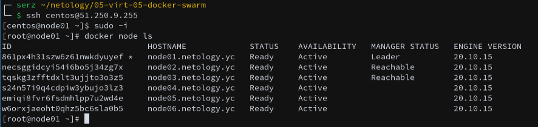
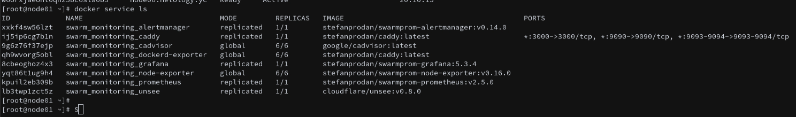

# Домашнее задание к занятию "5.5. Оркестрация кластером Docker контейнеров на примере Docker Swarm"

## Как сдавать задания

Обязательными к выполнению являются задачи без указания звездочки. Их выполнение необходимо для получения зачета и диплома о профессиональной переподготовке.

Задачи со звездочкой (*) являются дополнительными задачами и/или задачами повышенной сложности. Они не являются обязательными к выполнению, но помогут вам глубже понять тему.

Домашнее задание выполните в файле readme.md в github репозитории. В личном кабинете отправьте на проверку ссылку на .md-файл в вашем репозитории.

Любые вопросы по решению задач задавайте в чате учебной группы.

---

## Задача 1

Дайте письменые ответы на следующие вопросы:

- В чём отличие режимов работы сервисов в Docker Swarm кластере: replication и global?
  - В globalрежиме запуска одной реплики службы на узел роя. Количество глобальных реплик равно количеству узлов роя. В replicaрежиме вы можете запускать любое количество экземпляров службы.
- Какой алгоритм выбора лидера используется в Docker Swarm кластере?
  - Для обеспечения отказоустойчивости кластера используется алгоритм Raft — любой из manager-узлов в любой момент времени может заменить leader-узел
- Что такое Overlay Network?
  - Overlay Network - абстракция над Underlay,  виртуальная сеть туннелей, натянутая поверх Underlay, она позволяет ВМ одного клиента общаться друг с другом, при этом обеспечивая изоляцию от других клиентов.

## Задача 2

Создать ваш первый Docker Swarm кластер в Яндекс.Облаке

Для получения зачета, вам необходимо предоставить скриншот из терминала (консоли), с выводом команды:
```
docker node ls

```


## Задача 3

Создать ваш первый, готовый к боевой эксплуатации кластер мониторинга, состоящий из стека микросервисов.

Для получения зачета, вам необходимо предоставить скриншот из терминала (консоли), с выводом команды:
```
docker service ls
```

## Задача 4 (*)

Выполнить на лидере Docker Swarm кластера команду (указанную ниже) и дать письменное описание её функционала, что она делает и зачем она нужна:
```
# см.документацию: https://docs.docker.com/engine/swarm/swarm_manager_locking/
docker swarm update --autolock=true
```
```bash
[root@node01 ~]# docker swarm update --autolock=true
Swarm updated.
To unlock a swarm manager after it restarts, run the `docker swarm unlock`
command and provide the following key:

    SWMKEY-1-wyBwlwCqba8pMI2TtEIoXedob3GSBVHzxvBVEXMgo1E

Please remember to store this key in a password manager, since without it you
will not be able to restart the manager.

```

```
Даннная ккоманда слуужет для включения или октлюченния автоблокировки на сущетвующем рое 

Взаимный ключ TLS и ключ шифрования, используемые для чтения и записи журналов Raft,
хранятся в незашифрованном виде на диске. 
Существует компромисс между риском сохранения незашифрованного ключа шифрования в покое
и удобством перезапуска роя без необходимости разблокировки каждого менеджера
```

